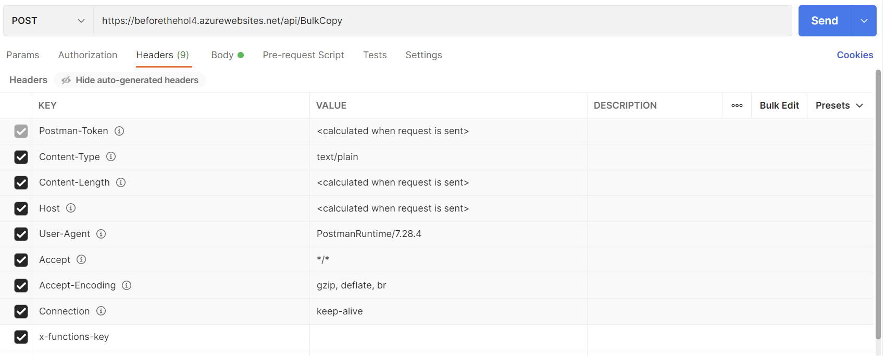
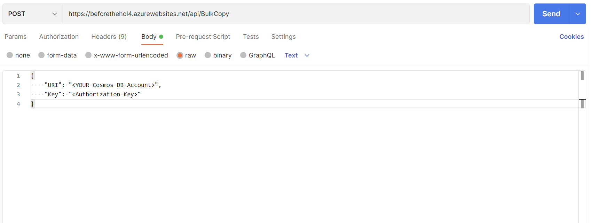
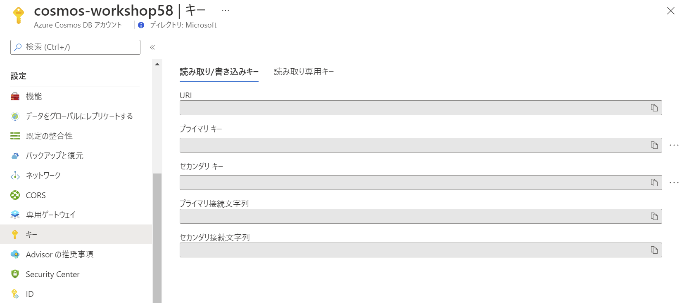
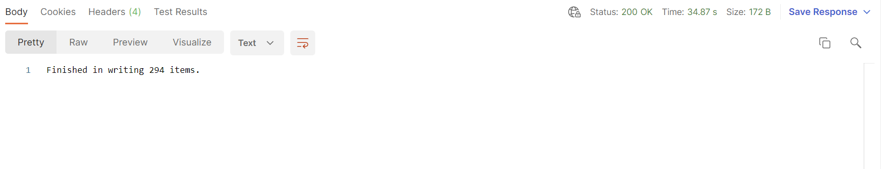
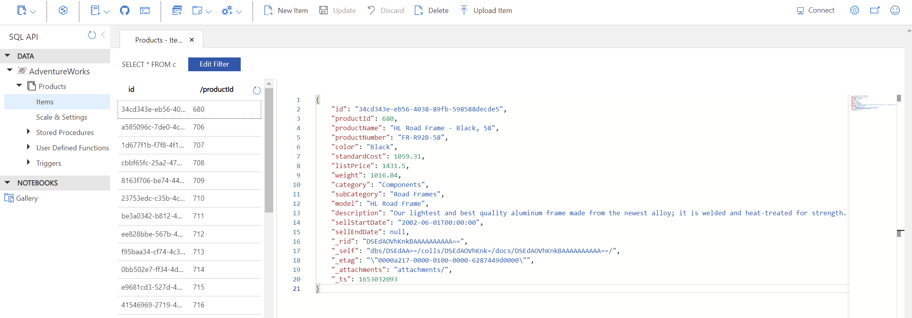
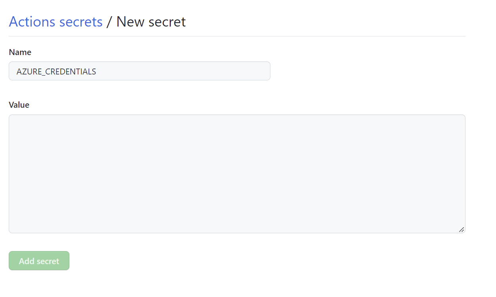
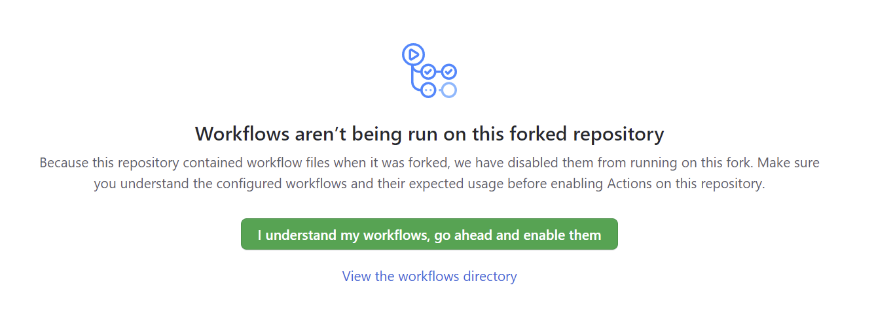
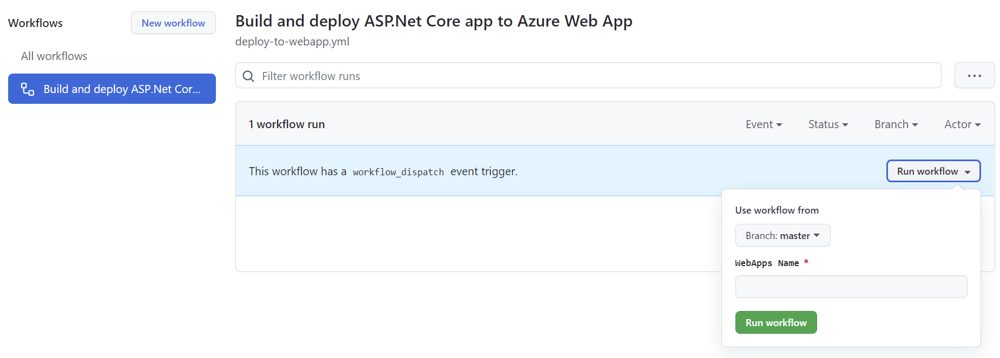

Protect and Scale Apps Hands-on lab  
June 2022

<br />

### 参考情報
- <a href="https://docs.microsoft.com/ja-jp/azure/cloud-adoption-framework/ready/azure-best-practices/resource-naming">名前付け規則を定義する</a>

- <a href="https://docs.microsoft.com/ja-jp/azure/cloud-adoption-framework/ready/azure-best-practices/resource-abbreviations">Azure リソースの種類に推奨される省略形</a>

<br />

## リソースの展開

<br />

[](https://portal.azure.com/#create/Microsoft.Template/uri/https%3A%2F%2Fraw.githubusercontent.com%2Fkohei3110%2FPublic-Application-Management-Hands-on-Lab%2Fmaster%2Ftemplates%2Fdeploy-resources.json)

### パラメーター
- **virtualNetworkName**: 仮想ネットワーク名（長さ：2 ～ 64 / 有効な文字：英数字、アンダースコア、ピリオド、およびハイフン）

- **addressPrefix**: IPv4 アドレス空間

- **subnetName1**: サブネットの名前 (1)（長さ：1 ～ 80 / 有効な文字：英数字、アンダースコア、ピリオド、およびハイフン）

- **subnetPrefix1**: サブネット アドレス範囲 (1)

- **subnetName2**: サブネットの名前 (2)（長さ：1 ～ 80 / 有効な文字：英数字、アンダースコア、ピリオド、およびハイフン）

- **subnetPrefix2**: サブネット アドレス範囲 (2)

- **webAppName**: Web アプリの名前（一意に識別できる名前 / 長さ：2 ～ 60  / 有効な文字：英数字とハイフン）

- **cosmosAccountName**: Cosmos DB アカウント（一意に識別できる名前 / 長さ：3 ～ 44 / 有効な文字：小文字、数字、およびハイフン）

- **logAnalyticsWorkspace**: Log Analytics ワークスペース名（長さ：4 ～ 63 / 有効な文字：英数字、およびハイフン）

<br />

※事前にリソース グループの作成が必要

※選択したリソース グループのリージョンにすべてのリソースが展開

<br />

### 展開後のリソース


<br />

## リソースの設定

※ **リポジトリを自身の GitHub アカウントに Fork ** してから作業を行ってください。

※  [Postman](https://www.postman.com/downloads/) を使用しますので、デスクトップ環境にインストールください。

### Cosmos DB

- データベースの作成とデータのコピー

  - Postman を起動し、新しいリクエストを作成

    - リクエスト メソッド: **POST**

    - API URL: **https://beforethehol4.azurewebsites.net/api/BulkCopy**

  - **Headers** タブへ移動しヘッダーを追加

    - KEY: **x-functions-key**

    - VALUE: キーは発行しますので hiroyay@microsoft.com まで連絡ください。

      

  - **Body** タブへ移動し **Raw** を選択

  - POST するデータを記述

    

    ```
    {
        "URI": "<YOUR Cosmos DB Account>",
        "Key": "<Authorization Key>"
    }
    ```

    ※ URI, Key には作成した Cosmos DB の URI とプライマリ キーを指定

    

  - **Send** をクリックし実行

    ※ 正常に終了すると Cosmos DB へ item が追加された応答を受信

    

- データの確認

  - Azure ポータルで Cosmos DB アカウントを表示

  - データ エクスプローラーを選択し items を表示

    - Database: **AdventureWorks**

    - Container: **Product**

      

  - items 数をカウントするクエリを実行

    ```
    SELECT COUNT(1) as 'COUNT' FROM c
    ```

    ※ アイテム数が 294 であることを確認

<br />

### Web アプリケーションの展開

  - Azure ポータルから Cloud Shell を起動しサービス プリンシパルを作成

    ```
    az ad sp create-for-rbac --name "<service principal name>" --role contributor --scopes /subscriptions/<subscription id> --sdk-auth
    ```

    ※ subscription id には作成先のサブスクリプション ID を指定

    ※ サブスクリプションに対する共同作成者の権限を付与

  - 上記 az ad sp create-for-rbac コマンドを実行後、ロール割り当て資格情報を含む JSON オブジェクトが出力

    ```
    {
      "cliendId": "<GUID>",
      "clientSecret": "<GUID>",
      "subscriptionId": "<GUID>",
      "tenantId": "<GUID>"
      (...)
    }
    ```

  - 出力された JSON オブジェクトをコピー

  - GitHub リポジトリの **Settings** を表示、**Actions secrets** へ新しいシークレットを作成

    - シークレット名: **AZURE_CREDENTIALS**

    - 値: コピーした JSON オブジェクトを貼り付け

      
 
  - <a href="../../actions">GitHub Actions</a> へ移動

  - **I understand my workflows, go ahead and enable them** をクリック

    

    ※フォークされたリポジトリで無効にされたワークフローを許可

    ※メッセージが表示されない場合は、GitHub へサインインが必要

  - ワークフローを実行し、アプリケーションを展開

    - **Run workflow** をクリックし、展開先の Web Apps の名前をパラメータへ入力

    - **Run workflow** をクリック

    

<br />

- Web アプリケーションの構成

  - WebApps の **構成** ページでアプリケーション設定の値を入力

    - 名前: **CosmosDbEndpoint** / 値: Cosmos DB アカウントの URI

    - 名前: **AuthorizationKey** / 値: Cosmos DB アカウントのプライマリ キー

    展開時に既に環境変数として追加済みのため編集で値だけ入力

  - **保存** をクリックし、アプリケーションを再起動

<br />

- アプリケーションの動作確認

  - App Service の **概要** ページの **URL** をクリック

  - 新しいタブでアプリケーションが表示

    

  - Name 列の項目に含まれている文字列を検索ワードに指定し検索を実行

    

    ※ 大文字、小文字を判別するため注意

  - 検索ワードに以下を指定し、再度検索を実行

    - JavaScript を埋め込み

      ```
      ' --<script>alert('1');</script>
      ```

      

      <br />

    - 他サイトの情報を埋め込み

      ```
      ' --<iframe width="100%" height="166" scrolling="no" frameborder="no" allow="autoplay" src="https://w.soundcloud.com/player/?url=https%3A//api.soundcloud.com/tracks/771984076&color=%23ff5500&auto_play=true&hide_related=false&show_comments=true&show_user=true&show_reposts=false&show_teaser=true"></iframe>
      ```

      

      <br />

    ※ XSS 攻撃が成功し、JavaScript の実行や他サイトの情報が表示されることを確認