Protect and Scale Apps Hands-on lab  
June 2022

 

### 参考情報

- [Azure Chaos Studio のドキュメント](https://docs.microsoft.com/ja-jp/azure/chaos-studio/)

 

## リソースの展開

## Exercise ★: Chaos Studio を使った実験 (ToDo: エクササイズ番号を後で入れる)

### Task 1: ターゲット(Cosmos DB)のオンボード

- Azure ポータルのトップ画面から **検索バー** のテキストボックスに **Chaos Studio** と入力

- 表示される候補より **Chaos Studio** を選択

　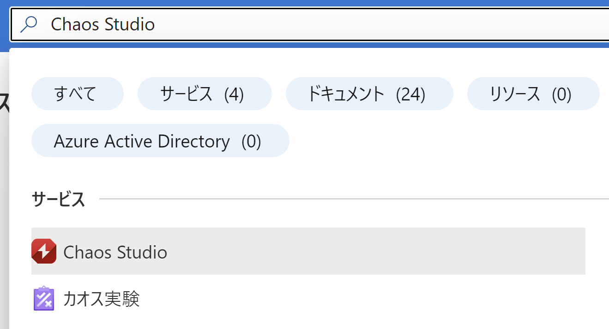

- **対象** をクリック

　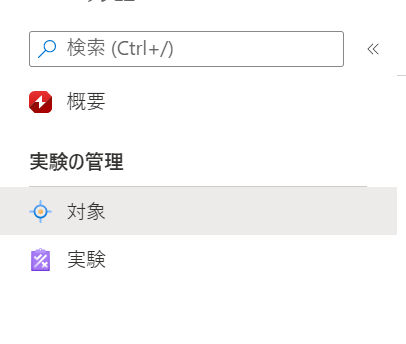

- ワークショップで使用中のサブスクリプション、リソースグループを選択し、Cosmos DB にチェック

　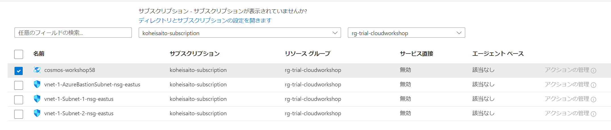

- **ターゲットを有効にする**をクリックし、**サービス直接ターゲット（すべてのリソース）を有効にする**をクリック

　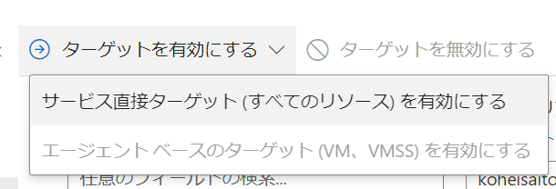

 

### Task 2: 実験作成

- Azure ポータルのトップ画面から **検索バー** のテキストボックスに **Chaos Studio** と入力

- 表示される候補より **Chaos Studio** を選択

　

- **実験** をクリック

　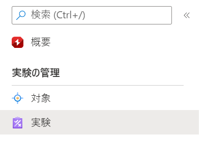

- **+ 作成** をクリック

- 実験の作成画面が表示

    - 必要項目を入力し **次へ: 実験デザイナー >** をクリック

      - サブスクリプション： ワークショップで使用中のサブスクリプションを選択

      - リソース グループ： ワークショップで使用するリソース グループを選択

      - 名前: experiment-001（任意）

      - 場所: East US

　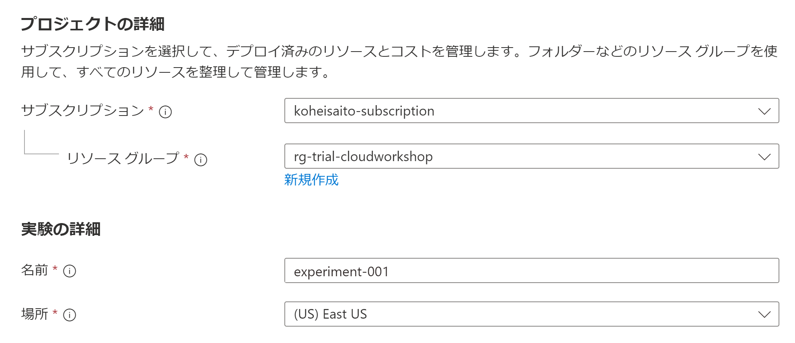

- 実験デザイナーが表示

    - 必要項目を入力し **+ アクションの追加** をクリック

      - ステップ： Inject Incident（任意）

      - ブランチ: Inject CosmosDB Failover（任意）

　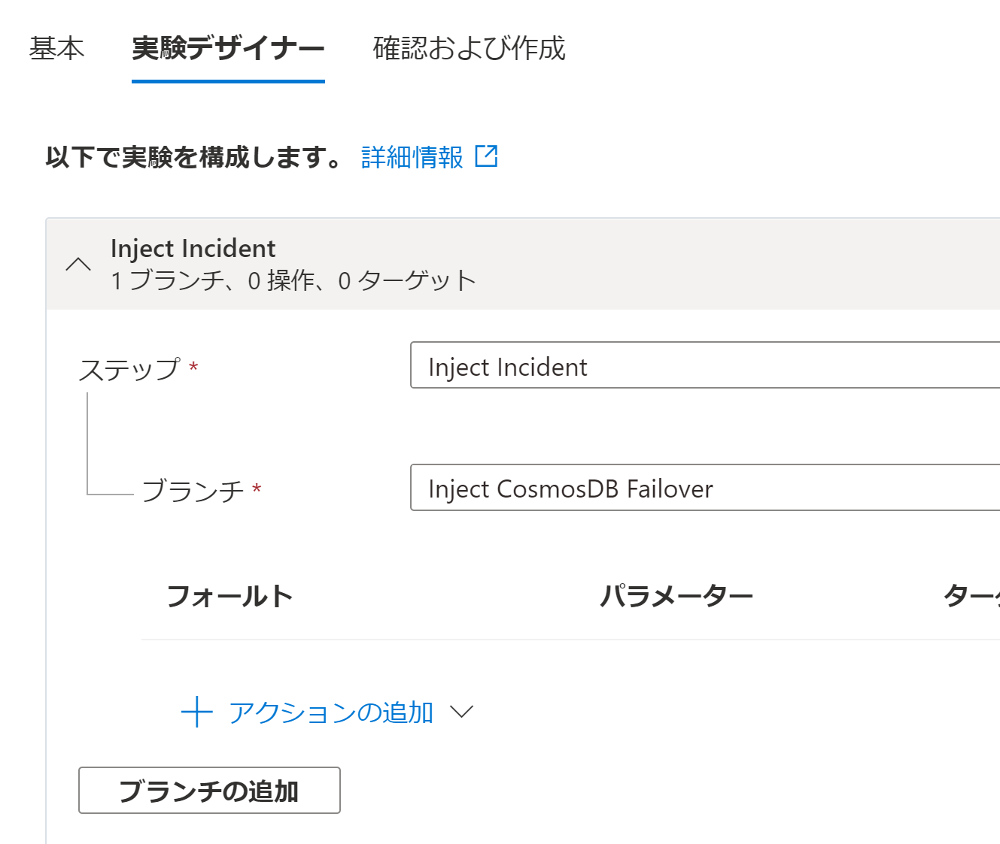

- フォールトの追加が表示

    - フォールト: **CosmosDB Failover**

    - 以下のパラメーターを入力し、**次へ: ターゲット リソース** をクリック

        - Duration (minutes): **10**

        - readRegion: **West US**

　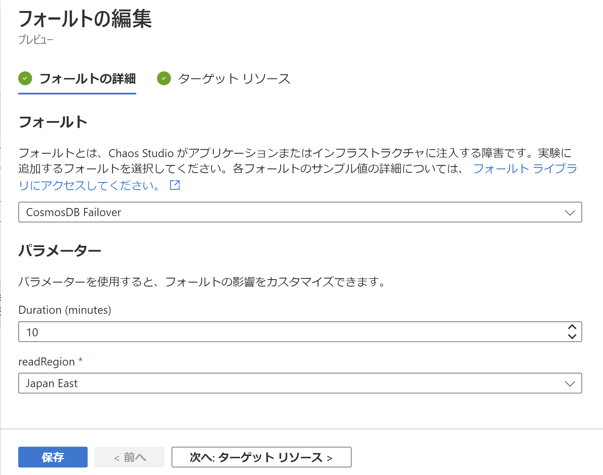

- ターゲットリソースが表示

    - ワークショップで使用する Cosmos DB を選択し **追加** をクリック

　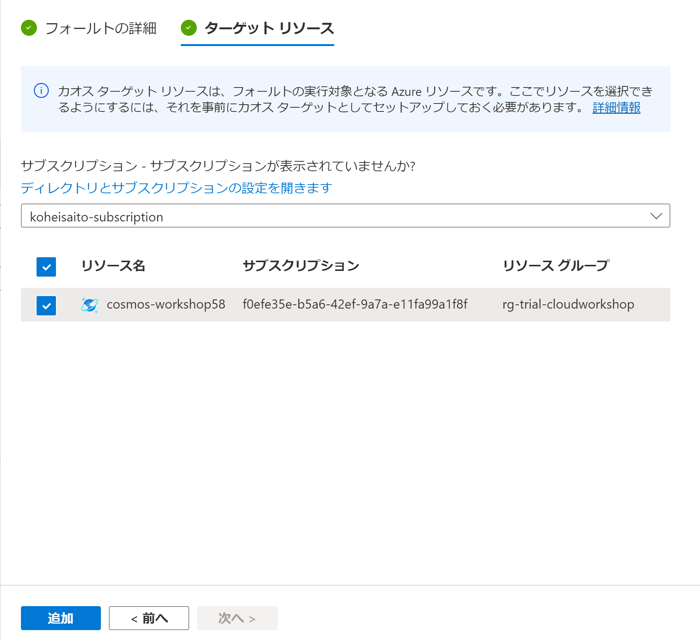

- **確認および作成**をクリック

- 表示内容を確認し問題がなければ **作成** をクリック

　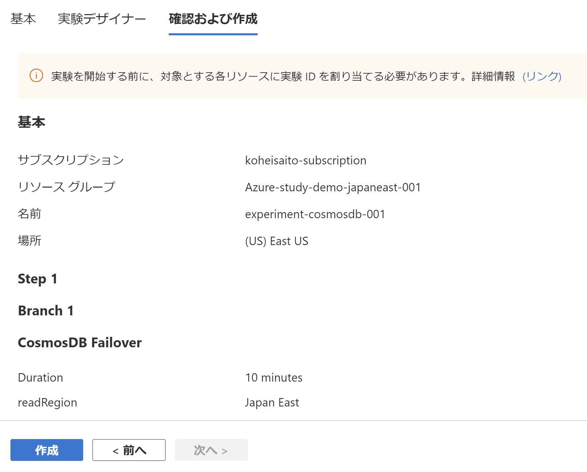

### Task 3: マネージド ID への権限付与

- Azure ポータルのトップ画面から **検索バー** のテキストボックスに **Azure Cosmos DB** と入力

- 表示される候補より **Azure Cosmos DB** を選択

　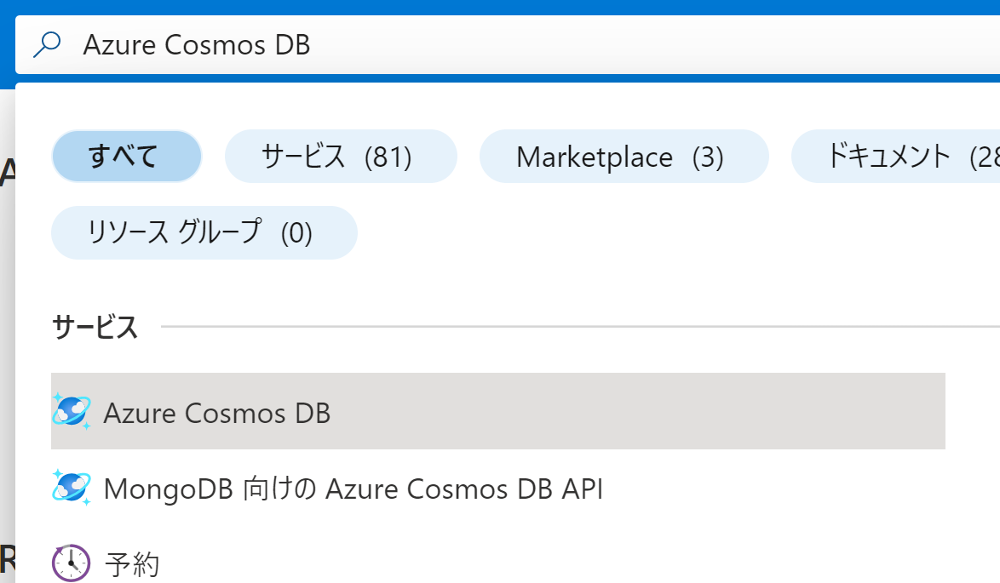

- ワークショップで使用中の Cosmos DB を選択

　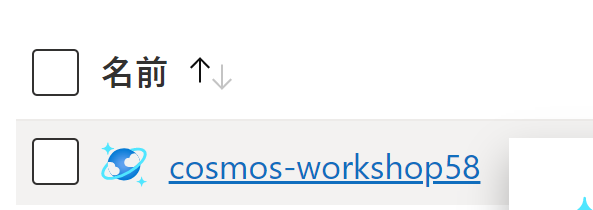

- **アクセス制御（IAＭ）** を選択し、**+ 追加**、**ロールの割り当ての追加**を選択

　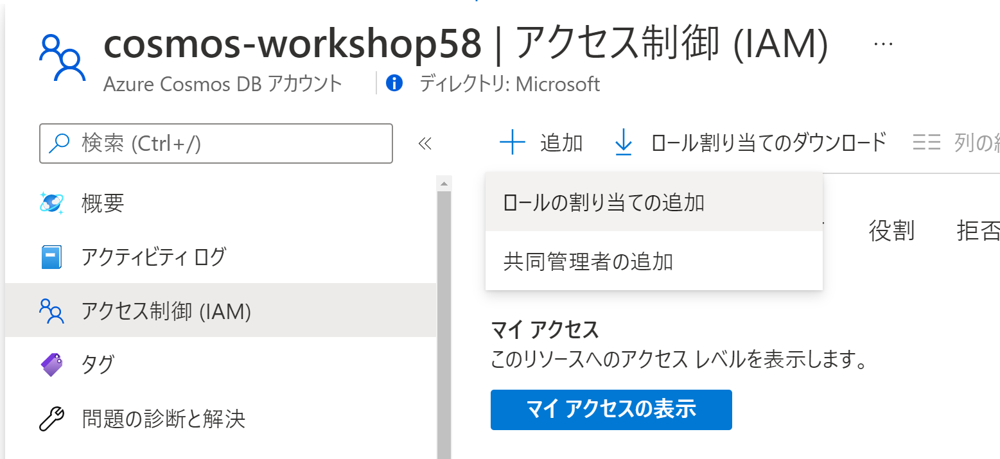

- **Cosmos DB 演算子**を入力し、**Cosmos DB 演算子**を選択し、**次へ**を選択

　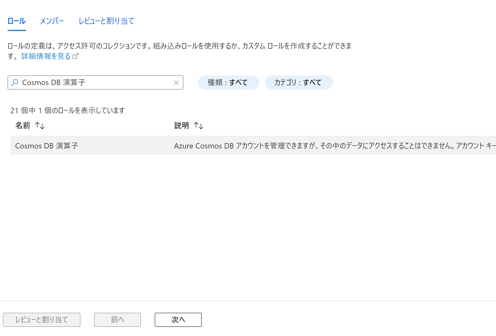

- 必要項目を入力し **次へ** をクリック

    - アクセスの割り当て先: **マネージド ID**
    - メンバー
        - サブスクリプション: ワークショップで使用中のサブスクリプションを選択
        - マネージド ID: **カオス実験**
        - 選択: **experiment-001**（作成した実験名）

　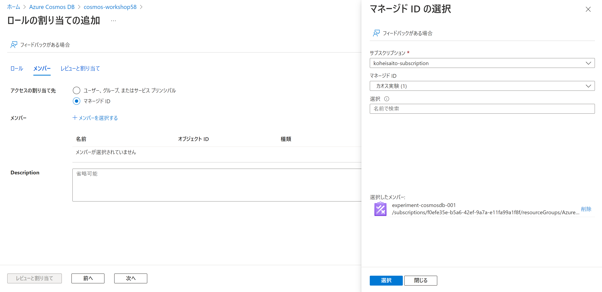

 - 表示内容を確認し問題がなければ **レビューと割り当て** をクリック

 　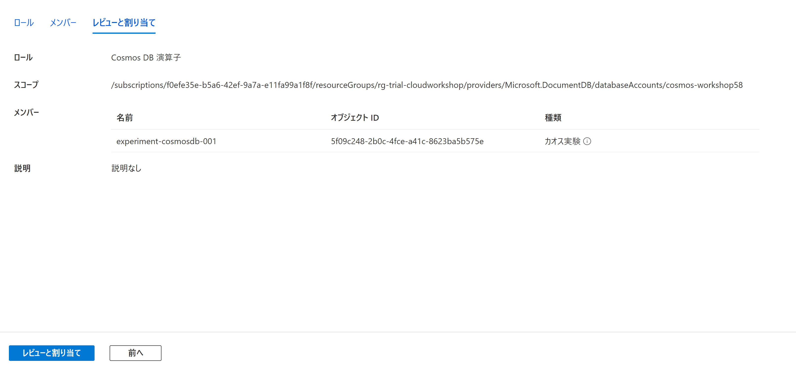

- ワークショップで使用中の Cosmos DB を選択

　

- **データをグローバルにレプリケートする**を選択し、読み取りリージョンに**West US**を追加し、**保存**をクリック

　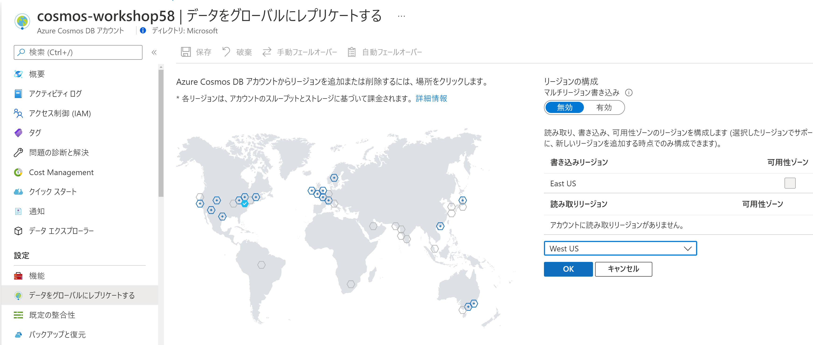

### Task 4: 実験実行

- Azure ポータルのトップ画面から **検索バー** のテキストボックスに **Chaos Studio** と入力

- 表示される候補より **Chaos Studio** を選択

　

- **実験** をクリックし、作成済みの実験をクリック

　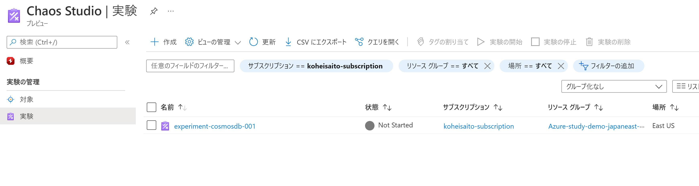

- **▶ 開始**をクリックし、実験を開始

　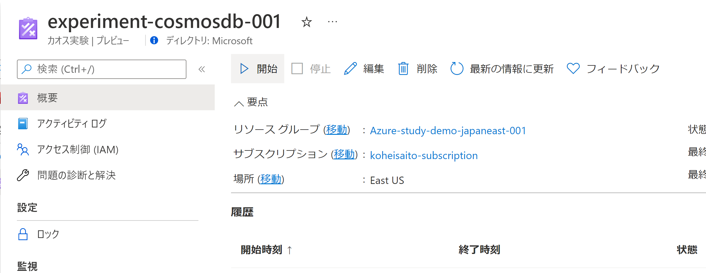

### Task 5: 実験結果確認

**※アクティビティログが出力されるまで、実験開始から約5分ほどかかります。**

 

- ワークショップで使用中の Cosmos DB を選択

　

- アクティビティログを選択し、**Manual Failover** を選択

　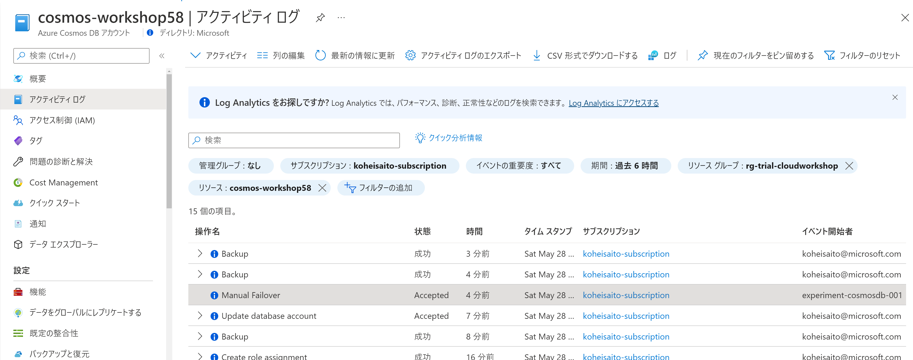

- **変更履歴（プレビュー）** を選択し、**properties.writeLocations** を選択

　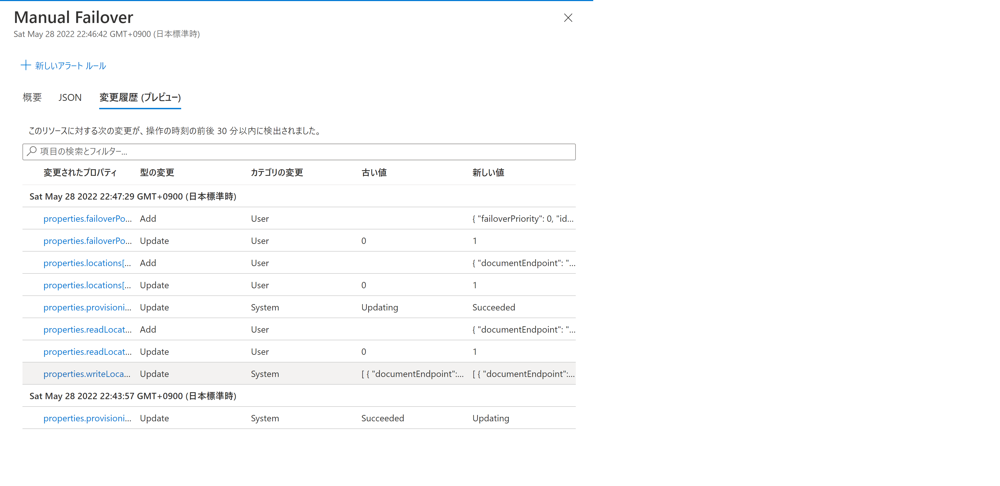

- **locationName** が **West US** に変更されていることを確認

　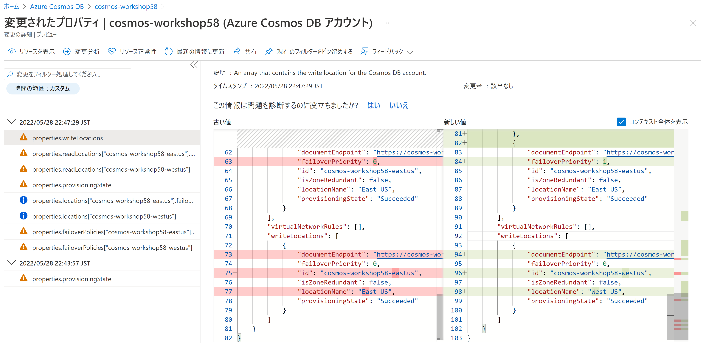